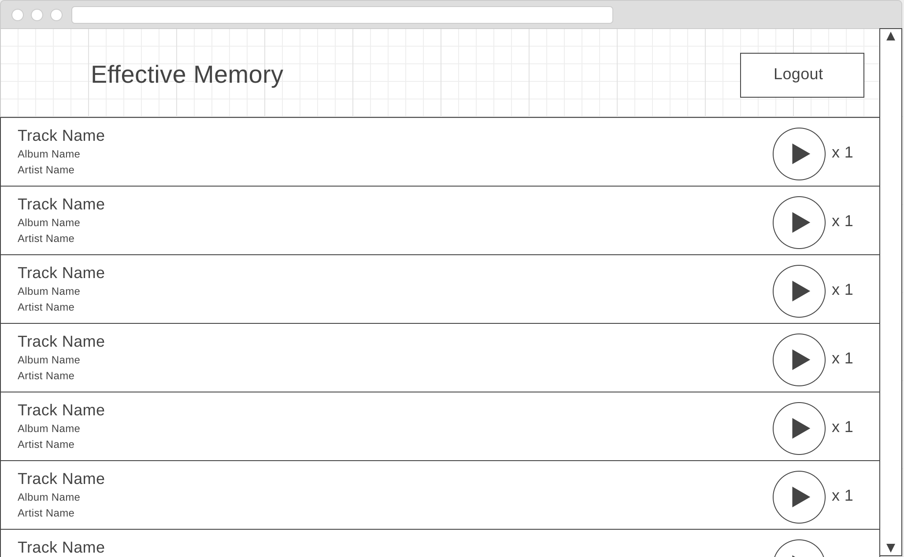

# effective-memory
Bython Canidate Test

## Requirements
The task is to create a web application utilizing the MEAN Stack, http://mean.io/. The user stories are

* As a user I would like to be able to use my Spotify account to login to the site.
* As a user I would like to view a list of tracks in my Spotify library.
* As a user I would like the list of tracks in my Spotify library to be stored in my local account for redundancy.
* (Bonus) As a user I would like to be able to click a play button displayed next to each track in the list in order to listen to that track on the device where my Spotify account is currently active.
* (Bonus) As a user I would like to see a count of how many times I've clicked the play button per track.

## Authentication
The application should use JWT for authentication.

## Resources
https://developer.spotify.com/web-api/authorization-guide/
The application should use the Authorization Code authenitcation flow.

https://developer.spotify.com/web-api/get-users-saved-tracks/

https://developer.spotify.com/web-api/get-information-about-the-users-current-playback/

https://www.sitepoint.com/user-authentication-mean-stack/

## Wireframe

